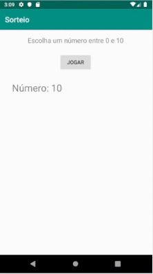

<h1>First Mobile App</h1>

Repositório destinado a guardar o primeiro aplicativo 
    mobile escrito em Java. Trata-se de um app bem simples com 
    finalidade de aplicar os conhecimentos adquiridos.

Para desenvolver este aplicativo foi necessário o uso do Android Studio
    e de emuladores para android.

 A aparência da home é algo como:

Alguns Links Úteis

<a href="https://developer.android.com/studio">https://developer.android.com/studio</a>

<a href="https://developer.android.com/training/basics/firstapp?hl=pt-br">https://developer.android.com/training/basics/firstapp?hl=pt-br</a>

<a href="https://www.java.com/pt_BR/">https://www.java.com/pt_BR/</a>

<a href="https://www.digitalocean.com/community/tutorials/como-instalar-o-java-com-apt-no-ubuntu-18-04-pt">https://www.digitalocean.com/community/tutorials/como-instalar-o-java-com-apt-no-ubuntu-18-04-pt</a>
